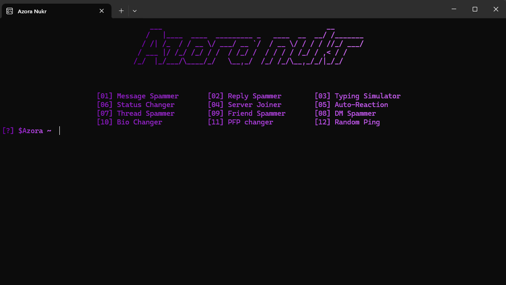

# Disclaimer
Due to my recent ban, i'd like to keep it clear that I am NOT liable for any damages caused by this tool. I created this with strictly the intent of testing discord anti-raid on your OWN server. Any damages caused by this tool will not make me at fault. Thank you.

<table>
  <tr>
    <td></td>
  </tr>
</table>


[Join the discord!](https://discord.gg/RsuR3DWzj5)

# What is Azora Nukr?
Azora Nukr is a discord raider with 12+ modules
You might be wondering how this can be used?
- Maybe your a moderator trying to test your anti-raid
- Maybe your trying to pull a funny prank on your friends(with their consent)?

Well no matter the use case, Azora Nukr is the best, free, and most powerful raider to go.

Interested? Well [click here](https://github.com/AzoraProject/Azora-Nukr#installation) for the installation guide!

# Why choose us?
The reason why you should choose us? Well, theres many of them!

## Reason 1: At Azora, we always try to make sure that our tools can be used by anyone even without extensive background knowledge of programming.
- In our [discord server](https://discord.gg/RsuR3DWzj5), we provide easy tutorials on use, and support if anything goes wrong.
- On our raider, you just input your tokens and the tool does the reset for you.

## Reason 2: We provide the best software, with no risk of malicious software, or backdoors.
- All of our software is open source, meaning you can look through the code and check whether theres malware or not, but we can rest you assured that everything is safe.
- Any bugs that may be unsafe, are **EASILY** reportable in our [discord](https://discord.gg/RsuR3DWzj5), as soon as you send the report, we will get onto it and make sure our software experience remains enjoyable and safe 
# Features
- Azora Nukr currently has 12 modules.
 ```
            [01] Message Spammer 02] Reply Spammer 03] Typing Simulator
            [06] Status Changer 04] Server Joiner 05] Auto-Reaction
            [07] Thread Spammer 09] Friend Spammer 08] DM Spammer
            [10] Bio Changer 11] PFP changer [12] Random Ping
```
# Requirements
- Windows 11/10 pc for the script to run on
- A [discord](https://discord.com) account
- A [python](https://www.python.org/downloads/) installation
# Installation
Installing Azora Nukr is simple, just follow these quick steps

- 1: Install [python](https://www.python.org/downloads/), you need to install python due to the fact its the coding language our tool uses
- 2: Download the [raider](https://github.com/AzoraProject/Azora-Nukr/archive/refs/heads/main.zip) from [here](https://github.com/AzoraProject/Azora-Nukr/archive/refs/heads/main.zip)

- 3: Find the location its downloaded in, right click on it, and extract it.

- 4: After all of these are complete, run setup.bat which will download and install all of the required libraries for the software and then start the software


# How to use
After installing the raider, heres what you have to do!
( if you havent already installed it then folow the guide above )
### Step 1.
- 1. Getting discord tokens needed for the raider. In order to use Azora Nukr, you need discord tokens. There are 2 methods to get them.
  - 1. Buying tokens using money. If you do not want to manually create accounts, you can buy lots of tokens in online stores
  - 2. Getting the token of your alt account. I recommend watching [this](https://www.youtube.com/watch?v=LnBnm_tZlyU) video to do so 
### Step 2. Adding tokens to your raider
- 1. Input a valid discord token(s) inside of the TOKENS.txt file. In order to add more than one, seperate each token with a new like this.
```
token1
token2
token3
```
### Step 3. Using the tool itself
- 1. Open setup.bat. Setup.bat is a windows batch script that will download all the required python libraries needed for the script
- 2. After the script loads, you should be prompted with a command line interface. First, join all your tokens into the server your attempting to raid. If your tokens are fully verified, you should be able to use the token joiner, elsewise, you will have to join them manually.
- 3. After all the tokens are inside the server, choose an option, input the details nesscary and watch the magic happen!

# Problems and solutions

### Setup.bat doesnt work!
- If setup.bat does not work, ensure that you have python installed

### None of the options work
- Make sure all your tokens are joined into the server
### Literally any other issue
- Make a ticket in our [discord server](discord.gg/RsuR3DWzj5
If you encounter any other issues, make sure to join our [discord server](https://discord.gg/RsuR3DWzj5) and report them there

